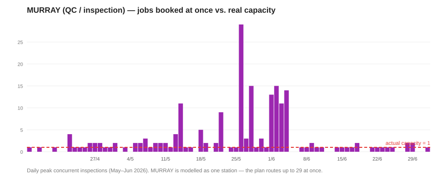
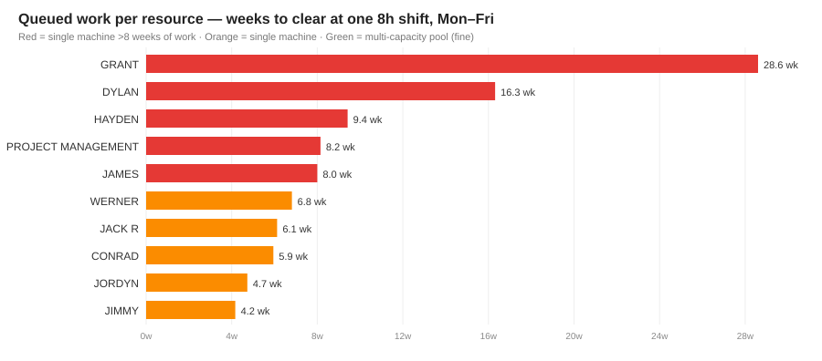

# Stafford Scheduling — Current Setup & How We Schedule Going Forward

**Purpose:** align on how Stafford's work should be scheduled before we tune CTP further.
This is a discussion document built from your own data, not a verdict.

**Data analysed:** the **3 June 2026** Genius snapshot (the full Stafford dataset —
not the slim demo). All figures below come straight from that export.

---

## 1. The dataset at a glance

| | Count |
|---|---:|
| Total operations in snapshot | **2,563** |
| Completed | 179 |
| In progress (running) | 173 |
| Locked / pinned | 4 |
| **To be scheduled** | **2,207** |
| **Work-hours to be scheduled** | **~8,234 h** |

Of the work to schedule, **~69% runs on single named machines/people** (one job at a
time) and ~31% on multi-capacity work-center pools.

---

## 2. What the current Genius plan actually does

When we line the snapshot up against a realistic working calendar, the current plan
relies on two things that can't physically happen:

**(a) It runs single machines around the clock.**
94% of named-machine operations are scheduled as *continuous elapsed time* — start, then
run nights and weekends straight through. Example, operation **28485-F (Fabrication, 144 h)**
on machine **GRANT**:

| | Span |
|---|---|
| Genius plan | Wed 20 May 10:33 → Tue 26 May 10:33 = **6 days straight** (through the weekend) |
| Realistic (one 8 h shift, Mon–Fri) | **~4 weeks** |

Every near-term named-machine task (685 of them) is planned this way — none respect an
8 h/day shift.

**(b) It puts many jobs on one machine at the same time.**
Named machines can only do one job at a time, yet the plan stacks several at once:

| Machine | Jobs | Most running at once |
|---|---:|---:|
| MURRAY | 568 | **29** |
| CONRAD | 95 | 8 |
| ANDREW BARRY | 70 | 8 |
| HAYDEN | 41 | 7 |
| GRANT | 22 | 4 |

**29 of 41 machines are over-booked** this way. The clearest example is **MURRAY**, the
QC/inspection function — 568 short checks (avg 16 min) all funnelled through a single
station, peaking at **29 inspections booked at the same moment**:

In short: the near-term plan is a backlog piled onto the calendar, not a schedule the floor
can run. CTP, scheduling honestly (one job at a time, real shifts), surfaces the true
picture — which is why dates push out.

---

## 3. The real bottleneck is a handful of single machines

The pooled work centers are fine. The pressure is on specific named resources carrying
months of work on a single shift:

| Resource | Work-hours queued | At one 8 h shift |
|---|---:|---:|
| **GRANT** | 1,144 h | **~28.6 weeks** |
| **DYLAN** | 653 h | ~16.3 weeks |
| **HAYDEN** | 377 h | ~9.4 weeks |
| JAMES | 320 h | ~8.0 weeks |
| WERNER | 273 h | ~6.8 weeks |
| CONRAD | 238 h | ~5.9 weeks |
| *FABRICATION & WELDING (pool, cap 11)* | 773 h | *~1.8 weeks* |
| *POLISHING (pool, cap 4)* | 309 h | *~1.9 weeks* |

**GRANT alone holds ~1,144 hours — over six months of single-shift work.** That single
resource largely defines the schedule length. This is the conversation that matters most.

---

## 4. Data points we need Stafford to confirm

These are the levers that decide what "scheduled" means. Today the model is guessing on
each:

1. **Working calendars (shifts).** What hours does each resource really run?
   - Is the standard one 8 h shift, Mon–Fri? Two shifts? Any 24/7 cells?
   - Do welders/machines like **GRANT, DYLAN, HAYDEN** run extra shifts? (If GRANT runs
     two shifts, its 28-week queue roughly halves.)

2. **Parallel capacity.** How many operators/machines can each resource run at once?
   - Genius field `NumOfAvgResource` says e.g. Fabrication & Welding = 11, Polishing = 4.
     We've now wired that into capacity (it was being ignored). Please confirm those counts.
   - **MURRAY** is the QC/inspection function — 568 short checks (548 QC ops, ~16 min each),
     but flagged capacity **0** so it's treated as a single station. The plan routes up to
     29 inspections through it at once (chart above). Is QC one inspector, or a function
     that runs many in parallel? This single setting changes a lot of promise dates.

3. **Machine binding vs. pooling.** Should an operation be locked to one named machine
   (e.g. GRANT), or float to whichever qualified machine/operator is free?
   - Today the big Fabrication operations are pinned to individual people, which is what
     creates the GRANT bottleneck. If they can float across the Fab pool, the picture
     changes dramatically.

4. **Gaps between steps (LagHours).** Genius shows a default 4 h lag on ~94% of links.
   Is that a real hand-off/cure time to enforce, or just a default we should ignore?

5. **The existing backlog.** The near-term load genuinely exceeds capacity. We should agree
   that CTP will show **realistic promise dates and lateness** rather than a plan that
   only "fits" by over-booking — so you can see true late-delivery exposure and decide
   where to add shifts, outsource, or re-sequence.

---

## 5. Why this matters to Stafford

Your priority is avoiding late-delivery penalties. The current Genius plan hides the
backlog by running machines 24/7 and double-booking them — so the late-delivery risk is
invisible until it lands. CTP scheduling against your **real** calendars and capacity does
two things:

- **Shows true promise dates** per order, and exactly which late jobs are driven by which
  bottleneck (today: GRANT and a few single machines).
- **Makes the capacity decision concrete** — "GRANT has 28 weeks of work on one shift" is
  a number you can act on (second shift? more welders? float the work?), instead of a plan
  that quietly slips.

Once we've aligned on the five items in §4, we re-run the full dataset and show the
realistic schedule, promise dates, and the specific bottlenecks — and from there it's a
straight conversation about where capacity is worth adding.

---

*Prepared from the 3 June 2026 Genius snapshot. Figures are reproducible from the
`productionTaskWithAdvancedInfoViewEntity` export + resource calendar/capacity records.*
